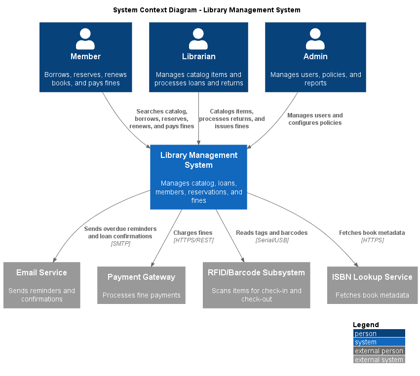
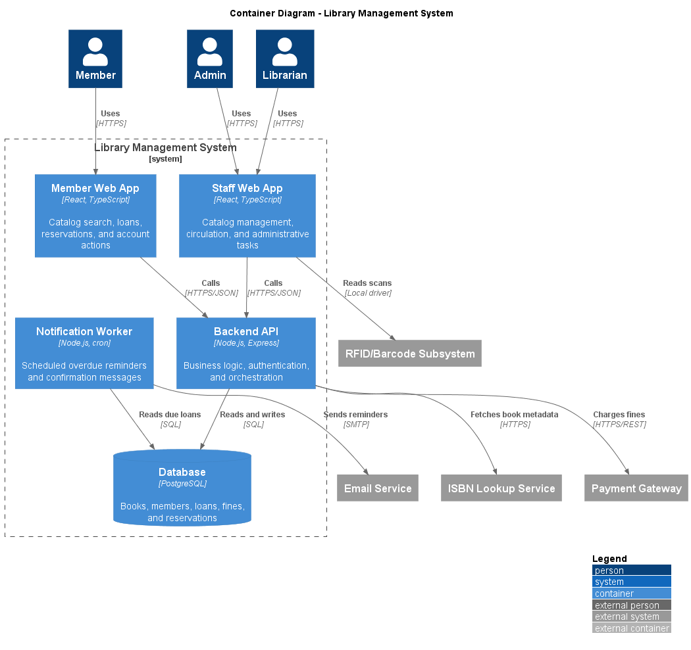
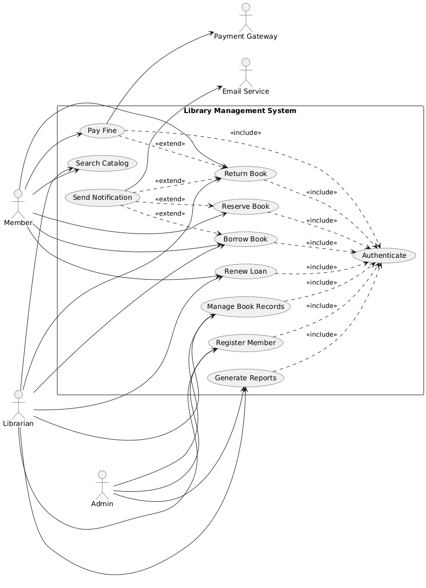
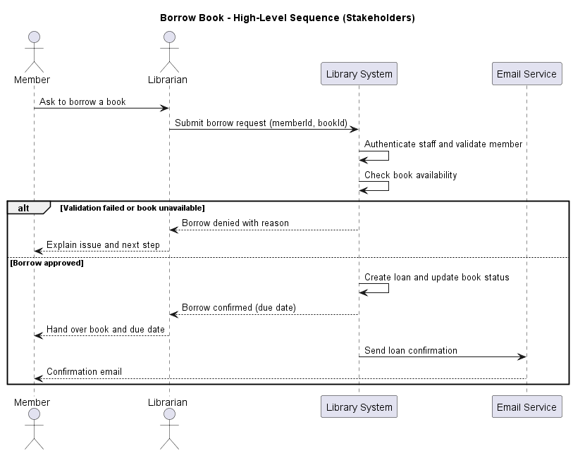
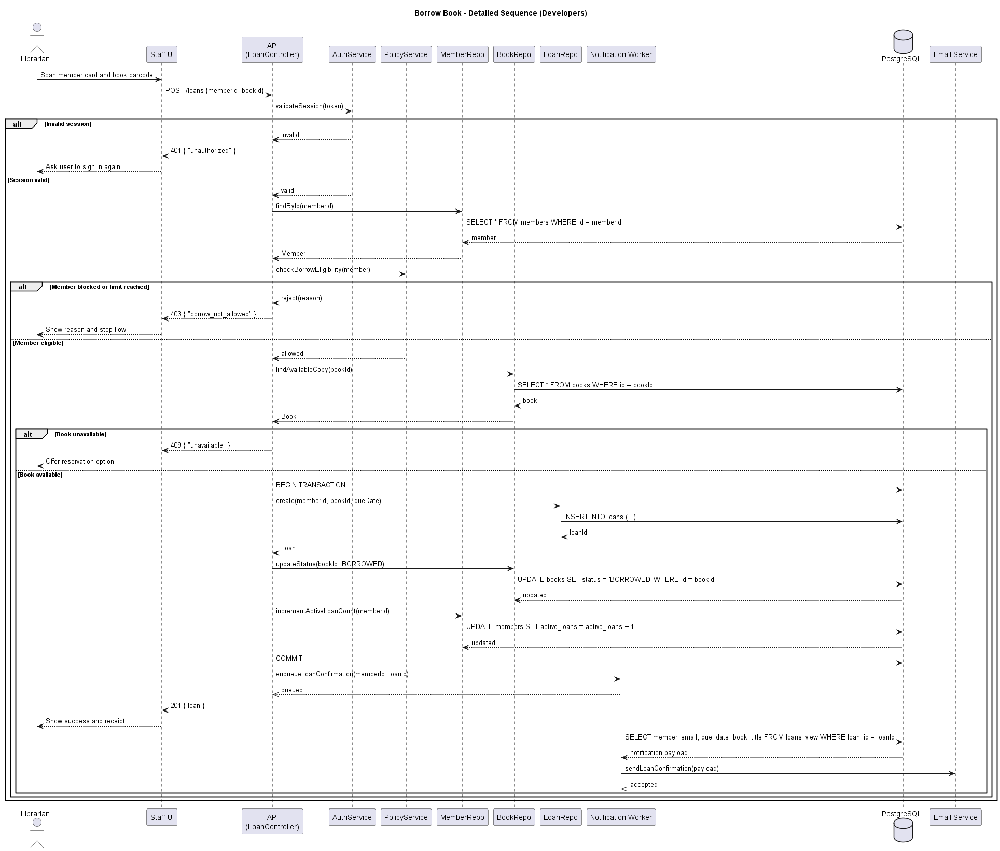
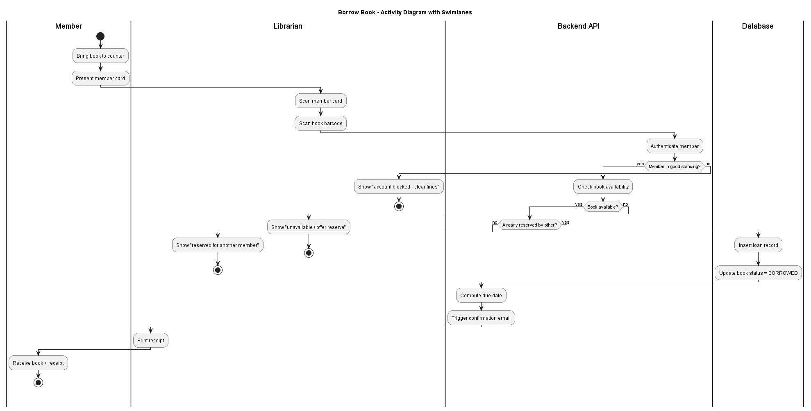
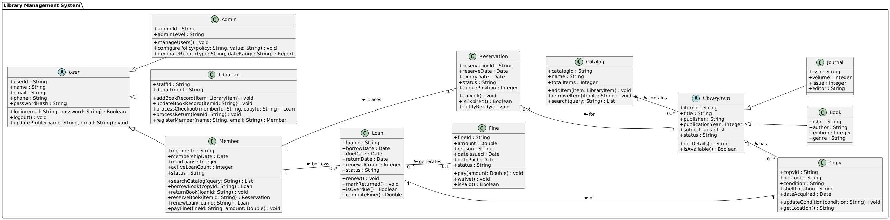
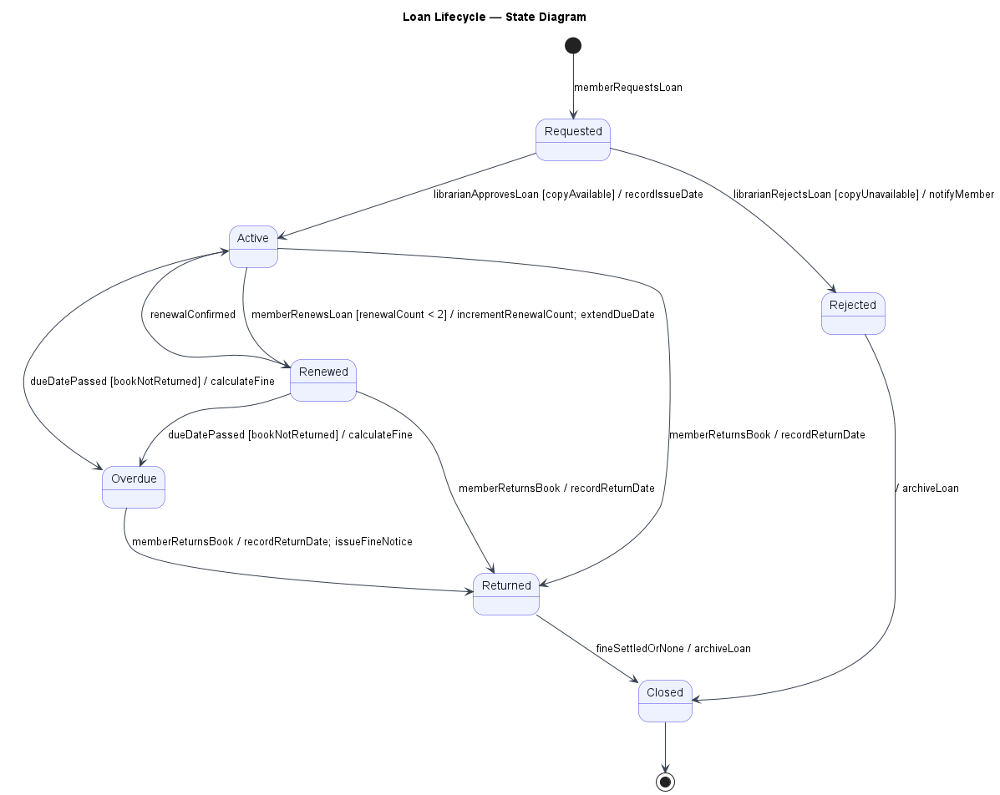

# Library Management System — Software Engineering Report

**Group 10 | Course: Software Engineering 13477 | Instructor: Dr. Samer Elkababji**

| Member | Student ID |
|---|---|
| Mohammad Abu Taha | 20230279 |
| Hashim Zuraiqi | 20230166 |
| Faris Asaad | 20230015 |
| Hytham Fares | 20230156 |

---

## 1. System Description

The Library Management System supports the everyday work of a small to medium library by combining member-facing self-service features with staff tools for circulation and catalog administration. Members use the system to search for books, place holds, borrow and return items, renew active loans, and pay overdue fines. Librarians use it to manage catalog records, check items in and out, update item status, and resolve circulation issues. Admin users handle account management, policy configuration, and reporting tasks that keep the library operating consistently.

The system is centered on a single source of truth for library data. That includes bibliographic records, copies or physical items, member accounts, loan history, reservation queues, and fine balances. Operational workflows are expected to be straightforward and auditable. For example, a borrow transaction should verify the member account, confirm that the requested item is available, create the loan record, update the item status, and trigger a notification so the member receives a confirmation.

External integrations are part of the normal workflow rather than special cases. The email service is used for reminders, confirmations, and due-date notices. The payment gateway is used when a member pays a fine. The RFID or barcode subsystem is used by staff when physical items are scanned during checkout, return, or inventory tasks. An ISBN lookup service is optional but useful when new titles are added, because it reduces manual catalog entry and improves metadata quality.

---

## 2. Context (C4 Level 1)

The system context diagram positions the Library Management System at the center of three human roles and four external systems. Members, Librarians, and Admins are the primary users, each with distinct interactions: members borrow, reserve, and pay fines; librarians manage circulation and the catalog; admins manage users and policies. The four external systems — Email Service, Payment Gateway, RFID/Barcode Subsystem, and ISBN Lookup Service — sit outside the system boundary because they are owned by third parties or depend on local hardware. The diagram makes those boundaries explicit so later design decisions can clearly distinguish what the team builds from what the team integrates with.

---

## 3. Containers (C4 Level 2)

The container view separates the user interface from the business logic and data storage. The Member Web App and Staff Web App are both React applications, but they serve different audiences and different interaction patterns. Members need a simple, public-facing experience optimized for search and self-service. Staff need denser screens for circulation, catalog editing, and administrative work. Splitting these applications avoids mixing unrelated screens and makes the permission model easier to control.

The Backend API is the core coordination layer. It owns authentication, authorization, validation, and the business rules that decide whether a loan can be created or a renewal can be granted. Putting this logic behind a single API keeps both web apps thin and reduces duplication. It also creates a clear place for shared rules such as loan limits, reservation priority, and overdue fine calculation.

The Database is modeled as its own container because the library needs durable transactional storage for core records. Loans, reservations, and fines should be updated consistently, so a relational database is a good fit. PostgreSQL provides strong constraints and transactions, which matter when multiple staff members or members are acting on the same item at the same time.

The Notification Worker is separated from the API so background reminders do not block user requests. Overdue notices, due-date reminders, and confirmation emails are scheduled or deferred work. Keeping them in a worker lets the API respond quickly to checkout and renewal requests while the worker handles retries and time-based jobs independently.

The external services remain outside the system boundary because they are owned and operated by third parties or hardware. The payment gateway is a remote dependency and should be isolated behind a clear integration point. The email service is similarly external, and the RFID or barcode subsystem is represented as a boundary interaction because it depends on local hardware or device drivers.

Overall, the design aims to keep the first release simple without collapsing everything into one application. The user interfaces are separated by audience, the API centralizes business logic, the database preserves consistency, and the worker handles asynchronous work.

---

## 4. Use Case Model

### 4.1 Use Case Diagram

The use case diagram organizes the eleven main features of the system around the three primary actors — Member, Librarian, Admin — and the two external secondary actors — Email Service and Payment Gateway. Authentication is shown as an `<<include>>` relationship because every member-facing or staff-facing operation must verify identity first. Two extension relationships make conditional behavior explicit: Pay Fine extends Return Book (only when a fine exists), and Send Notification extends Borrow, Return, and Reserve (only when the email step is triggered). This separation keeps the always-required behavior distinct from optional follow-ups.

### 4.2 Use Case Descriptions

#### UC-02: Borrow Book

| Field | Content |
|-------|---------|
| **Use Case ID** | UC-02 |
| **Use Case Name** | Borrow Book |
| **Primary Actor(s)** | Member, Librarian |
| **Secondary Actor(s)** | Email Service, System |
| **Before you start** | Member must be logged in; Member has a good account (no bans or too many overdue books); Member hasn't borrowed the max number of books; The book is actually available; Nobody else has reserved this book |
| **Main Flow** | 1. Librarian scans the member's card or types in their ID 2. System looks up the member and checks if they're OK to borrow 3. Librarian scans the book or types in the ISBN 4. System finds the book and checks if it's available 5. System counts how many books the member already has 6. System creates a record for this loan (due in 21 days) 7. System marks the book as BORROWED 8. System makes a confirmation email with the due date 9. Email gets sent to the member 10. Librarian hands the book to the member 11. System shows a success message |
| **Other things that might happen** | **2a. Member's account is blocked:** System stops the borrow and says why. Member needs to talk to the staff  **4a. Book isn't there:** System tells the librarian the book is checked out; System offers to put a hold on it (go to UC-04: Reserve Book)  **5a. Member has too many books out:** System shows how many they have and the limit  **8a. Email is down:** System still does the borrow anyway; System tries to send the email again later (up to 3 times) |
| **What happens after** | Loan is saved in the system; Book is marked as BORROWED; Member's book count goes up; Confirmation email sent (or will be sent); Everything is logged |
| **If something breaks** | Database problem: System says "Can't finish this. Try again or call support."; Can't read the barcode: Librarian types in the ISBN instead |

#### UC-03: Return Book

| Field | Content |
|-------|---------|
| **Use Case ID** | UC-03 |
| **Use Case Name** | Return Book |
| **Primary Actor(s)** | Member, Librarian |
| **Secondary Actor(s)** | Email Service, System |
| **Before you start** | Member must be logged in; The member is actually the one who borrowed this book; Librarian is ready to take the book back |
| **Main Flow** | 1. Librarian scans the member's card or ID 2. System finds all the books the member has checked out 3. Librarian scans the book or types the ISBN 4. System finds the matching loan record 5. System records the return date and time 6. System checks if it's late. If yes, calculates a fine 7. System marks the loan as RETURNED 8. System marks the book as AVAILABLE again 9. Librarian looks at the book for damage and notes it 10. System sends a return confirmation email 11. If there was a fine, the member can pay now (UC-06: Pay Fine) |
| **Other things that might happen** | **4a. Can't find the loan:** System says "This member didn't borrow this book"; Librarian double-checks the member ID and ISBN  **6a. Book is late:** System figures out the fine ($0.25/day, max $5); Shows the fine amount; Pay Fine would happen next (UC-06)  **9a. Book is damaged:** Librarian marks it as DAMAGED; System may charge the member for repairs |
| **What happens after** | Loan is marked RETURNED; Book is marked AVAILABLE; Member's book count goes down; Fine saved (if applicable); Return confirmation email is sent |

#### UC-04: Reserve Book

| Field | Content |
|-------|---------|
| **Use Case ID** | UC-04 |
| **Use Case Name** | Reserve Book |
| **Primary Actor(s)** | Member |
| **Secondary Actor(s)** | Librarian, Email Service, System |
| **Before you start** | Member must be logged in; Member is in good standing (not banned); The book exists in our system; Member hasn't already reserved this book |
| **Main Flow** | 1. Member searches for a book (UC-01: Search Catalog) 2. Member clicks on the book and clicks "Reserve" 3. System shows a summary (title, format, estimated wait time) 4. Member confirms the reservation 5. System saves the reservation 6. System puts the member in the queue (first come, first served) 7. System sends a confirmation email with the reservation ID and wait time 8. Member sees "Reservation successful" |
| **Other things that might happen** | **3a. No copies at all:** System says "No copies in our system"; System suggests similar books  **5a. Member already reserved this book:** System says "You already have a hold on this"; Nothing new is created  **6a. Book is actually available right now:** System may let you borrow it immediately |
| **What happens after** | Reservation is saved; Member's spot in the queue is set; Confirmation email is sent; Estimated wait time is calculated |

#### UC-06: Pay Fine

| Field | Content |
|-------|---------|
| **Use Case ID** | UC-06 |
| **Use Case Name** | Pay Fine |
| **Primary Actor(s)** | Member |
| **Secondary Actor(s)** | Librarian, Payment Gateway, Email Service, System |
| **Before you start** | Member must be logged in; There's a fine that hasn't been paid; Payment system is online |
| **Main Flow** | 1. System shows all unpaid fines with details 2. Member picks which fine(s) to pay and confirms the amount 3. System shows a payment form 4. Member enters their payment info 5. System sends it to the Payment Gateway 6. Payment Gateway processes it and sends back success or fail 7. If success: system saves the transaction ID 8. System marks the fine as PAID 9. System sends a receipt email 10. Member sees "Payment successful. Your fine is cleared." |
| **Other things that might happen** | **6a. Payment gets rejected:** System says "Payment declined. Try again or ask your bank."  **6b. Payment takes too long:** System says "Taking longer than expected. Try again later."  **3a. No fines owed:** System says "You don't have any fines." |
| **What happens after** | Fine is marked PAID with date and transaction ID; Member's fine balance is cleared; Receipt email is sent |

#### UC-07: Manage Book Records

| Field | Content |
|-------|---------|
| **Use Case ID** | UC-07 |
| **Use Case Name** | Manage Book Records |
| **Primary Actor(s)** | Librarian, Admin |
| **Secondary Actor(s)** | System |
| **Before you start** | User must be logged in (UC-08: Authenticate); User is a Librarian or Admin; Book exists in the system (or you're adding a new one) |
| **Main Flow** | 1. Librarian goes to the Catalog Management section 2. Librarian searches for the book by ISBN, title, or author 3. System shows matching books 4. Librarian picks one to edit 5. System shows the book details 6. Librarian updates stuff (add a copy, change the condition, add tags, etc.) 7. System checks the info is correct 8. Librarian confirms the changes 9. System saves it and records who changed it |
| **What happens after** | Book record is updated; Change date and who did it is recorded; If it's a new book: it gets a unique ID |

#### Shorter Descriptions for Remaining Use Cases

**UC-01: Search Catalog** — Member types in what they're looking for → System searches and filters by availability → Shows results with title, author, ISBN, and copy count → Member can borrow (UC-02), reserve (UC-04), or search again.

**UC-05: Renew Loan** — Member looks at their active loans → picks a book → system checks if they can renew it (max 2 renewals, no active reservations) → system gives them 21 more days → sends a confirmation email.

**UC-08: Register Member** — Librarian types in the member's name, phone, address, email → system checks it's all good → creates a member account with a unique ID → sends a welcome email with login info.

**UC-09: Generate Reports** — Admin picks what kind of report (circulation, fines, member activity, inventory) → system gets the data for the selected dates → makes and shows the report → admin can save as CSV or PDF.

**UC-10: Authenticate** — User types their username and password → system checks if it's right → creates a session → user goes to their dashboard. After 5 wrong tries, account gets locked.

**UC-11: Send Notification** — System determines what happened → gets the member's email → formats the message (book title, due date, fine amount) → Email Service sends it via SMTP. On failure, system retries up to 3 times over 24 hours.

---

## 5. Sequence Diagrams — Borrow Book

### 5.1 High-Level (Stakeholders)

The high-level sequence diagram is for stakeholders who need the big picture without implementation detail. It shows how Member, Librarian, the Library System, and the Email Service interact during a borrow request: the librarian submits the request, the system validates member and book conditions, and on success the system confirms the loan and sends an email confirmation. The diagram also keeps one simple alternative for failure (validation or availability), so non-technical viewers can see that the process has clear stop conditions as well as a normal success path.

### 5.2 Detailed (Developers)

The detailed sequence diagram is for developers and walks through each internal step and decision point. It uses alt blocks for invalid session, member ineligibility, and book unavailability, which prevents invalid loans from being created and keeps business rules explicit. In the success path, it shows concrete database writes for loan creation, book status update, and member loan-count update inside a transaction so records remain consistent. The confirmation notification is queued to a Notification Worker and then sent through the Email Service asynchronously; this design keeps the checkout response fast while still guaranteeing that the member receives a confirmation message.

---

## 6. Activity Diagram — Borrow Book Workflow

The activity diagram shows the Borrow Book workflow split across the Member, Librarian, Backend API, and Database lanes. It makes the three decision points — member standing, book availability, and existing reservations — visible as branches, so every failure path ends cleanly without creating a loan record. Where the sequence diagrams emphasize the order of messages between components, this diagram emphasizes the order of steps and which lane is responsible at each step, which is what stakeholders need to validate the workflow as a whole.

---

## 7. Class Diagram

### 7.1 Overview

The class diagram models the structural design of the Library Management System. It captures the eleven core classes, their attributes and operations, and the relationships between them. The design uses two inheritance hierarchies, one composition, one aggregation, and several associations with explicit multiplicities.

### 7.2 Inheritance Hierarchies

**User hierarchy:** `User` is an abstract superclass that holds the attributes shared by all account types — `userId`, `name`, `email`, `passwordHash`, and `isActive` — along with the common operations `login()`, `logout()`, and `updateProfile()`. The three concrete subclasses are `Member`, `Librarian`, and `Admin`. `Member` adds borrowing-specific data (`loanCount`, `maxLoans`, `fineBalance`) and member operations (`borrowBook()`, `returnBook()`, `reserveBook()`, `renewLoan()`, `payFine()`). `Librarian` adds staff operations (`checkoutItem()`, `processReturn()`, `manageCatalog()`). `Admin` adds system-level operations (`manageUsers()`, `generateReports()`, `configurePolicy()`). This hierarchy avoids duplicating the login/logout logic across three separate classes and makes the permission model explicit at the class level.

**LibraryItem hierarchy:** `LibraryItem` is an abstract superclass that holds the catalog attributes shared by all item types — `itemId`, `title`, `author`, `isbn`, `genre`, `publishedYear` — and the common operations `getAvailableCopies()` and `getDetails()`. The two concrete subclasses are `Book` and `Journal`. `Book` adds `pageCount` and `edition`. `Journal` adds `volume`, `issueNumber`, and `publisher`. This hierarchy allows the catalog and loan system to work with any item type uniformly while still letting individual item types carry type-specific metadata.

### 7.3 Composition and Aggregation

**Catalog ◆── LibraryItem (Composition):** The `Catalog` class owns `LibraryItem` objects. If the catalog is destroyed, its items cease to exist in the system. The multiplicity is `1` catalog to `0..*` items. `Catalog` exposes `addItem()`, `removeItem()`, and `searchItem()` operations. This is modeled as composition because library items have no identity or meaning outside the catalog — a book record that does not belong to any catalog is not a valid system object.

**LibraryItem ◇── Copy (Aggregation):** Each `LibraryItem` has one or more `Copy` objects, which represent the physical copies on the shelf. The multiplicity is `1` item to `1..*` copies. `Copy` carries `copyId`, `condition` (AVAILABLE, BORROWED, DAMAGED, LOST), and `shelfLocation`, along with `updateStatus()` and `getStatus()`. This is modeled as aggregation rather than composition because copies are tracked independently — a copy can be damaged or lost and still exist as a record in the system after the parent item record is updated.

### 7.4 Associations

**Member — Loan (1 to 0..*):** A member can have zero or many active loans. Each `Loan` records `loanId`, `borrowDate`, `dueDate`, `returnDate`, `status` (ACTIVE, OVERDUE, RETURNED), and `renewalCount`. Operations include `renew()`, `markReturned()`, and `isOverdue()`.

**Loan — Copy (Many to 1):** Each loan is for exactly one copy. This links the loan record to the specific physical copy that was checked out.

**Member — Reservation (1 to 0..*):** A member can have zero or many reservations. `Reservation` records `reservationId`, `reservationDate`, `expiryDate`, `status` (PENDING, FULFILLED, CANCELLED), and `queuePosition`. Operations include `cancel()` and `fulfil()`.

**Loan — Fine (0..1 to 0..1):** A loan may generate at most one fine. `Fine` records `fineId`, `amount`, `reason`, `issueDate`, `status` (UNPAID, PAID), and `paidDate`. Operations include `calculate()` and `markPaid()`.

---

## 8. State Diagram — Loan Lifecycle

### 8.1 Overview

The state diagram models the complete lifecycle of a `Loan` object from the moment a borrow request is made until the loan record is permanently closed. The diagram was chosen because the Loan entity is the central object in the system's core workflow — it is created in the Borrow Book use case (UC-02), modified in Renew Loan (UC-05) and Return Book (UC-03), and drives the fine calculation in Pay Fine (UC-06). Showing its states in one diagram makes those cross-use-case relationships visible in a single view.

### 8.2 State Descriptions

| State | Meaning |
|---|---|
| **Requested** | The member or librarian has initiated a borrow. The system is validating member eligibility and copy availability. No loan record exists yet. |
| **Active** | Validation passed. The loan record exists; the copy status is BORROWED; the due date is set (21 days from borrow date). The member is responsible for the item. |
| **Renewed** | The member requested a renewal and it was granted (no active reservation on the item; renewal count < 2). The due date is extended by 21 days. The loan returns to Active after the renewal is recorded. |
| **Overdue** | The due date has passed and the item has not been returned. The system calculates a fine. The member cannot borrow additional items until the item is returned. |
| **Returned** | The librarian has scanned the item back in. The return date is recorded. If a fine existed (from Overdue), it remains unpaid until the member pays it (UC-06). |
| **Closed** | The loan record is fully resolved — either returned with no fine, or the fine has been paid. The copy is marked AVAILABLE. The loan is archived. |
| **Rejected** | The borrow request failed validation (member ineligible, copy unavailable, or loan limit reached). No loan record is created. |

### 8.3 State-Stimulus Table

| Current State | Event / Stimulus | Guard Condition | Next State | Action |
|---|---|---|---|---|
| *(initial)* | Member requests borrow | — | Requested | Begin validation |
| Requested | Validation passes | Member eligible, copy available | Active | Create loan record; set due date; mark copy BORROWED; send confirmation email |
| Requested | Validation fails | Member ineligible OR copy unavailable OR loan limit reached | Rejected | Display reason; no loan record created |
| Active | Member requests renewal | renewalCount < 2 AND no active reservation on copy | Renewed | Extend due date by 21 days; increment renewalCount |
| Active | Member requests renewal | renewalCount >= 2 OR active reservation exists | Active | Display "Cannot renew"; due date unchanged |
| Renewed | Renewal recorded | — | Active | Update loan record with new due date |
| Active | Due date passes | item not returned by due date | Overdue | Calculate fine ($0.25/day); flag account; send overdue notice |
| Overdue | Librarian scans return | — | Returned | Record return date; mark copy AVAILABLE; fine remains UNPAID |
| Active | Librarian scans return | returned on or before due date | Returned | Record return date; mark copy AVAILABLE; no fine |
| Returned | Fine paid OR no fine | — | Closed | Archive loan; clear fine; restore full borrowing privileges |

---

## 9. Data Flow Diagrams

### 9.1 Level 0 — Context DFD

The Level 0 DFD (context diagram) treats the entire Library Management System as a single process and shows all external entities that send data to or receive data from it. External entities are: **Member** (search queries, borrow/return/reserve/renew requests, fine payments), **Librarian** (item scan events, catalog updates, return processing), **Admin** (user management commands, policy configuration, report requests), **Email Service** (outbound notification delivery), and **Payment Gateway** (payment authorization and confirmation). The Level 0 boundary makes clear what the team is building versus what it is integrating with.

### 9.2 Level 1 — Decomposed DFD

The Level 1 DFD decomposes the single system process into five sub-processes and shows the data stores they share.

| Process | Inputs | Outputs | Data Stores Used |
|---|---|---|---|
| **1.0 Process Loan** | Borrow/return/renew requests from Member and Librarian | Loan confirmation, overdue alert | D3 Loans, D2 Copies, D1 Members |
| **2.0 Manage Catalog** | Catalog updates from Librarian, ISBN lookup from Admin | Updated item records | D2 Copies, D4 Items |
| **3.0 Handle Reservations** | Reserve requests from Member, return events from 1.0 | Reservation confirmation, availability alert | D5 Reservations, D1 Members, D2 Copies |
| **4.0 Process Fines** | Overdue trigger from 1.0, payment from Member via Payment Gateway | Fine record, payment receipt | D6 Fines, D1 Members |
| **5.0 Send Notifications** | Events from 1.0, 3.0, and 4.0 | Emails via Email Service | D1 Members |

**Data Stores:**

| ID | Store | Contents |
|---|---|---|
| D1 | Members | Account records, borrowing limits, fine balances |
| D2 | Copies | Physical copy records, condition, shelf location |
| D3 | Loans | Active and historical loan records |
| D4 | Items | Bibliographic catalog records (title, ISBN, author) |
| D5 | Reservations | Reservation queue with position and expiry |
| D6 | Fines | Fine records with amount, reason, and payment status |

---

*End of Report — Group 10*
